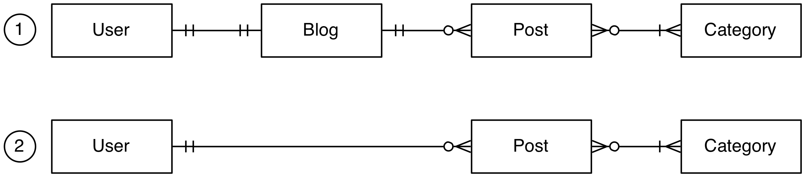
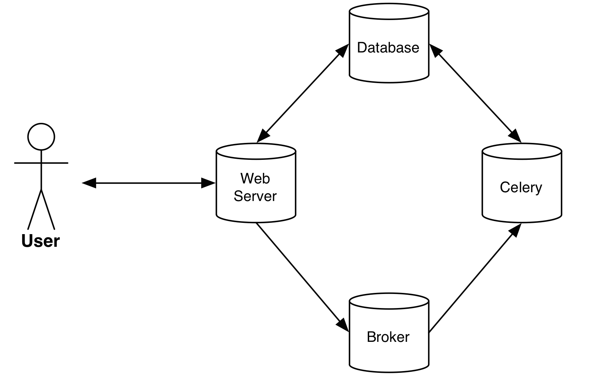
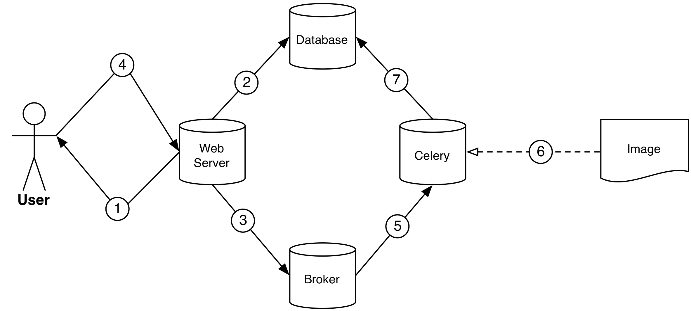

# Wordplease

Wordplease es una educada plataforma de blogging creada en Django para aprender Django.


## Índice

* [Instalación](#toc_2)
* [Arranque de la app](#toc_3)
* [Modelo de datos](#toc_6)
* [Arquitectura del sistema](#toc_7)
* [Descarga de una imagen en background](#toc_8)

## Instalación

Hay un script de instalación ```install.sh``` que: 

1. Crea el entorno virtual
2. Instala las dependencias en el mismo
3. Crea un usuario con privilegios de administrador
4. Carga un juego de datos de ejemplo
5. Ejecuta los tests de la plataforma

Para ejecutar el instalador, sitúate en la carpeta del proyecto desde el terminal y ejecuta:

```
$ ./install.sh
```

## Arranque de la app

### Servidor web

Para arrancar el servidor, hay que *activar el entorno virtual* y luego *arrancar el servidor* de desarrollo de Django.

Desde la carpeta del proyecto y en el terminal, ejecuta:

```
$ source env/bin/activate
(env)$ python manage.py runserver
```

### Celery (servicio de procesamiento en background)

Para arrancar Celery, hay que *activar el entorno virtual* y luego *arrancar el Celery*.

Desde la carpeta del proyecto y en el terminal, ejecuta:

```
$ source env/bin/activate
(env)$ celery -A wordplease worker -l info
```

## Modelo de datos

A nivel de modelo de datos, se planteaban dos posibles opciones:



1. Utilizar una entidad **Blog**, el cual pertenecía a sólo un **User** (que sólo puede tener un **Blog**) y la entidad **Post** pertenecería a un **Blog**, de manera que un **Blog** puede tener muchos **Post**. Por último, un **Post** estar clasificado una o varias **Category**, mientras que una **Category** puede haber cero o varios **Post**.
2. No utilizar la entidad **Blog** y directamente hacer que un **Post** pertenezca a un usuario.

En la solución implementada, he optado por la opción 1 (en la que existe la entidad **Blog**) ya que permite, por ejemplo, especificar el nombre del blog de un usuario y se podría utilizar en un futuro para almacenar información de parametrización. Lo que esto implica es una dificultad añadida a la hora de registrar y actualizar usuarios a través de la web o el API, ya que también hay que gestionar (crear/actualizar) la entidad **Blog** del usuario como si fuera un todo. 

## Arquitectura del sistema

El sistema está compuesto por cuatro diferentes servicios para ofrecer la funcionalidad completa:



El **Web Server** se encarga de interactuar con el usuario (recibir sus peticiones y devolver las respuestas usando el protocolo HTTP).

Este **Web Server** tiene conexión de lectura/escritura a una base de datos (**Database**) para guardar y recuperar los datos del sistema (es donde se almacena el [Modelo de datos](#toc_7)).

Por otro lado, el **Web Server** tiene una conexión con un **Broker**. La misión del **Broker** es simplemente pasar mensajes de un sitio (el **Web Server**) a otro (**Celery**). Estos mensajes es la información necesaria para que desde **Celery** se ejecute una tarea en background (la descarga asíncrona de imágenes y la creación de los thumbnails).

Por último nos encontramos con **Celery**, que se encargará de recibir los mensajes enviados por el **Web Server** a través del **Broker** para ejecutar alguna tarea en segundo plano (en nuestro caso, descargar la imagen destacada de un **Post** y hacer un thumbnail).

## Descarga de una imagen en background

Imaginemos que tenemos una imagen de altísima resolución que pesa 200MB. Si queremos que, cuando un usuario cree un **Post** a través de la web o del API, la imagen se descargue y además hagamos un thumbnail (hacer una copia de la imagen en una resolución menor), esto podría hacer que la web tardara en responder cuando el usuario hace la petición (algo nada deseable).

Para este tipo de tareas que requieren varios segundos de ejecución, se suele recurrir al procesamiento en segundo plano o background. En nuestro caso, utilizaremos **[Celery](http://www.celeryproject.org/)**, procesador de cola tareas que se ejecuta en segundo plano y cuya integración con Django es trivial.

### ¿Cómo funciona Celery?

**[Celery](http://www.celeryproject.org/)** se encarga de ejecutar tareas almacenada en una cola (que es el **Broker**).

### Flujo de ejecución en la creación de un Post



Cuando se crea un **Post**, ya sea desde la web o desde el API, se dan los siguientes pasos:

1. El usuario envía una petición (desde la web o desde el API) para la creación de un **Post**
2. Esa petición es recibida por el **Web Server**, el cual ejecuta el código Django correspondiente que crea un nuevo **Post** y lo guarda en la base de datos.
3. El **Web Server** envía una tarea al **Broker** para que se encole. La tarea lleva como información relacionada el **Post** que acabamos de crear.
4. El **Web Server** responde al usuario indicándole que el **Post** se ha creado correctamente. **ATENCIÓN:** en este punto, el usuario ya ha recibido una respuesta pero la tarea de descarga aún no ha comenzado.
5. El **Broker** comunica a **Celery** que hay una nueva tarea y éste, si tiene algún *worker* libre, comienza la tarea. 
6. **Celery** ejecuta la tarea de descarga de la imagen a partir de la URL destacada y crea el thumbnail.
7. **Celery** actualiza la URL de la imagen destacada del **Post** para que en lugar de ser la URL del servidor remoto, se sirva el thumbnail de la imagen generado en nuestro servidor local. 

### ¿Cómo lo hemos hecho?

Para que siempre que se cree un **Post** se ejecute la tarea, hemos utilizado los [signals](https://docs.djangoproject.com/en/1.10/topics/signals/) de Django. 

Los [signals](https://docs.djangoproject.com/en/1.8/topics/signals/) de Django permite ejecutar código cuando ocurre un evento. 

En nuestro caso utilizamos la señal [django.db.models.signals.post_save](https://docs.djangoproject.com/en/1.10/ref/signals/#django.db.models.signals.post_save), la cual nos permite ejecutar una función tras guardar un modelo (en nuestro caso un **Post**).

Esta función se encargará de llamar a la función que se ejecuta en **[Celery](http://www.celeryproject.org/)**, la cual se ejecuta en segundo plano para descargar la imagen y crear el thumbnail (ver ```blogs/tasks.py```).

### Configuración necesaria para que funcione Celery

Tras seguir la [guía de uso de Celery con Django](http://docs.celeryproject.org/en/latest/django/first-steps-with-django.html):

#### Configurar el broker

Para producción se suele utilizar como brokers [RabbitMQ](https://www.rabbitmq.com) o [Redis](http://redis.io).

En nuestro caso, utilizamos como broker uno de desarrollo (```kombu```). Para ello, en el archivo settings del proyecto ```wordplease/settings.py``` añadimos la aplicación ```kombu.transport.django``` e indicamos como ```BROKER_URL``` ```django://``` (simulando un protocolo de conexión interno).

```python
[...]
INSTALLED_APPS = (
    ...
    'kombu.transport.django',
)
[...]
```

#### Decoramos la función que queremos que se ejecute en celery

Para que un código se ejecute en  **[Celery](http://www.celeryproject.org/)**, tan sólo debemos decorar la función con el decorador ```@ shared_task ```. 

Se puede observar en ```blogs/tasks.py```:

```python
from celery import shared_task

@ shared_task  # makes this function a celery task
def download_resize_update_photo_image(post):
	[...]
```

Este decorador convierte la función en un objeto ```Task``` de **[Celery](http://www.celeryproject.org/)**. Para ejecutar esta tarea tenemos qeu llamar a su método ```delay```:


Se puede observar al final de ```blogs/models.py```:

```python
def download_image_on_save(sender, **kwargs):
    post = kwargs.get('instance')
    if post and settings.BASE_URL not in post.image_url:
        download_resize_update_photo_image.delay(post)  # <--------
```
